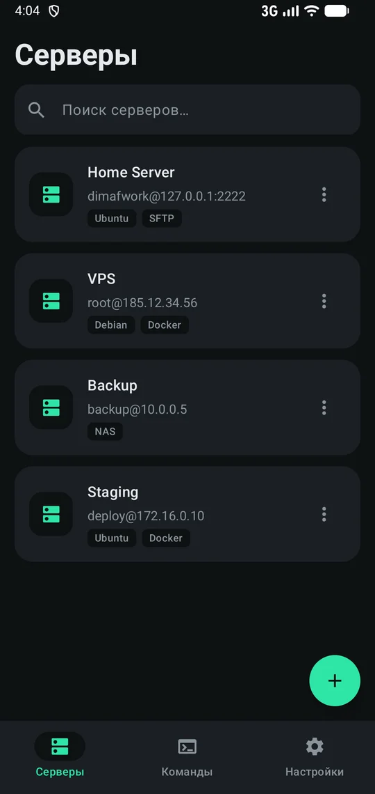
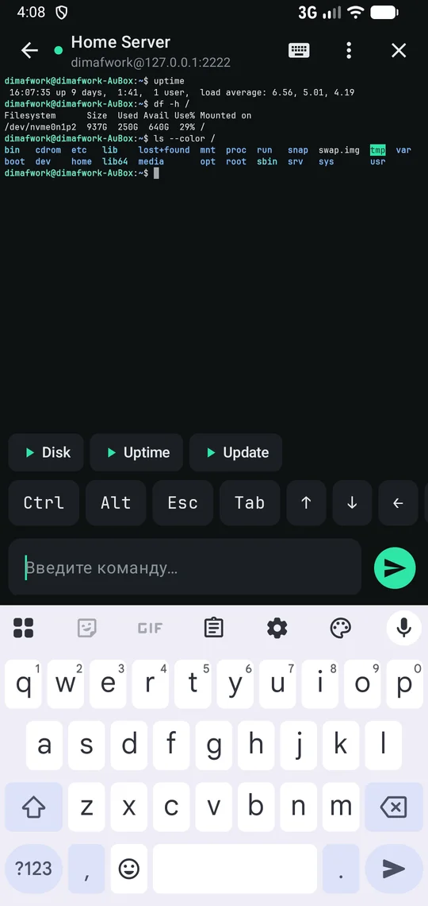
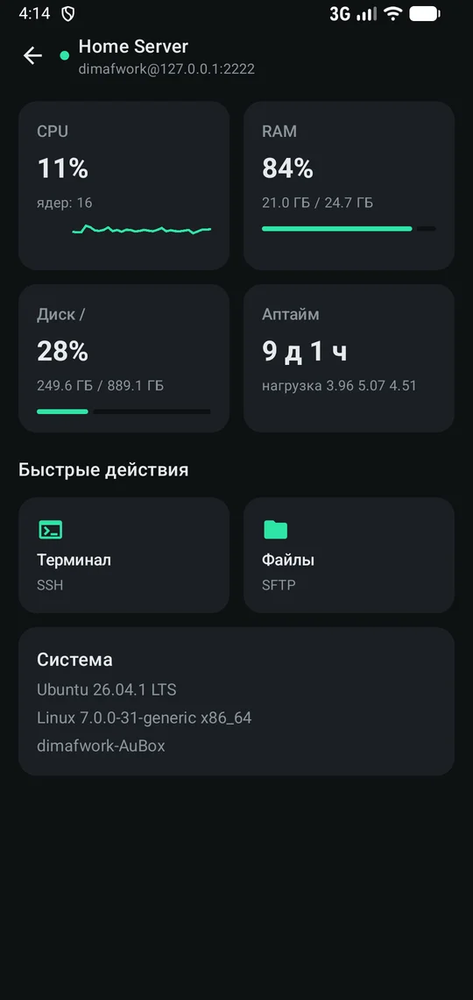
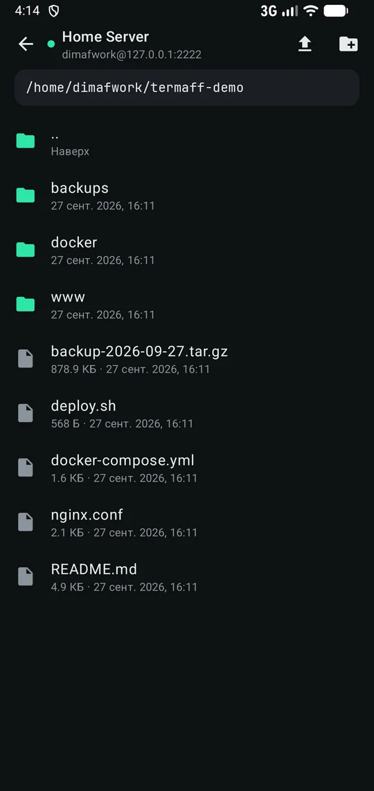
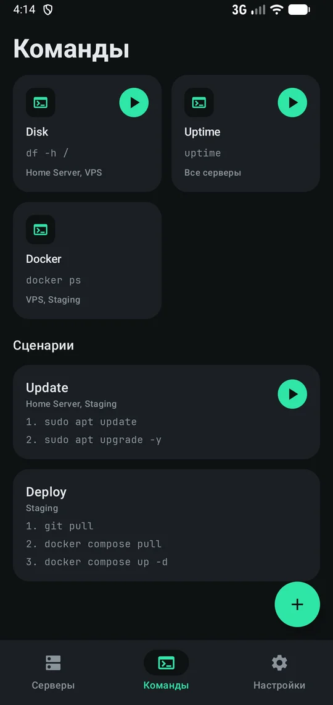
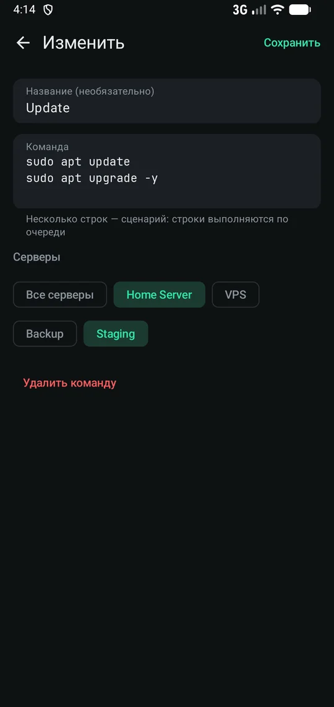
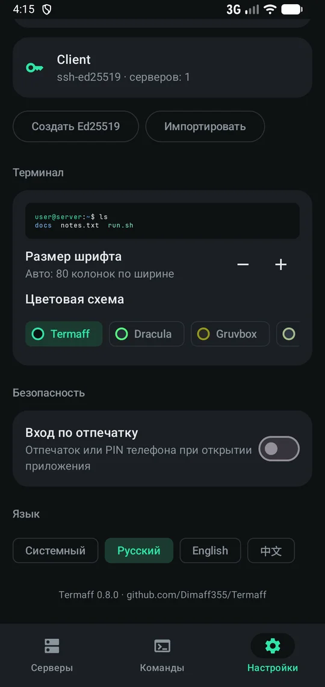

# Termaff

Бесплатный минималистичный SSH-клиент для Android — лёгкий аналог Termius.

<p>




</p>
<p>



</p>

- **Серверы** — список с поиском и тегами, копирование сервера, вход по паролю или ключу (Ed25519, RSA, ECDSA).
- **Нормальная клавиатура** — команды набираются в обычной строке ввода: работают свайпы,
  автозамена и голосовой ввод. В `vim`/`less`/`mc` прямой режим включается сам (кнопка — вручную);
  в нём символы уходят сразу с любой клавиатурой, включая Яндекс и SwiftKey.
- **Ключи SSH** — создание Ed25519 прямо на телефоне, импорт ключей OpenSSH/PEM (Ed25519, RSA, ECDSA,
  с паролем или без); публичный ключ для `authorized_keys` — скопировать или отправить в одно касание.
  Один ключ можно использовать для нескольких серверов.
- **Вид терминала** — размер шрифта (авто под 80 колонок, кнопками или щипком двумя пальцами),
  цветовые схемы: Termaff, Dracula, Gruvbox, Nord, светлая.
- **Быстрые команды и сценарии** — частые команды плитками, сценарии из нескольких шагов;
  для всех серверов или только для выбранных (одного, двух — любого числа). В терминале — кнопки над клавишами: нажатие выполняет,
  долгое нажатие вставляет в строку ввода.
- **Работа в фоне** — несколько сессий одновременно (переключение вкладками в терминале);
  соединения не рвутся при сворачивании (уведомление с кнопкой «Отключить все»). Мёртвое соединение
  замечается за ~30 с, после обрыва сессия переподключается сама — экран терминала сохраняется.
- **Обзор сервера** — загрузка CPU с графиком, память, диск, аптайм и нагрузка, версия системы;
  обновляется каждые 3 с. Ничего не нужно ставить на сервер — данные читаются из `/proc`.
- **Файлы (SFTP)** — переход по папкам, скачивание в телефон, загрузка с телефона, новая папка,
  переименование и удаление. Обзор и файлы работают через уже открытое подключение — без повторного входа.
- **Панель клавиш** — Ctrl/Alt (липкие), Esc, Tab, стрелки, Home/End, PgUp/PgDn, спецсимволы.
- **История команд** — ↑/↓ в строке ввода; пароли (`sudo`, `su`) вводятся скрыто и в историю не попадают.
- **Безопасность** — вход по отпечатку или PIN телефона (Android 11+); пароли и ключи шифруются
  Android Keystore; ключ сервера проверяется по отпечатку при первом входе, подмена ключа блокирует
  подключение. Без рекламы, аналитики и облака.
- **Языки** — русский, English, 中文; по умолчанию как в системе, меняется в Настройках сразу, без перезапуска.

## Установка

Скачайте `Termaff-X.Y.Z-arm64-v8a.apk` из последнего релиза на странице
[Releases](https://github.com/Dimaff355/Termaff/releases) — подходит для всех современных телефонов
(Android 8 и новее). Новая версия ставится поверх старой, серверы сохраняются.

Сборки под другие архитектуры (`armeabi-v7a`, `x86_64`, `universal`) не публикуются —
их можно собрать самостоятельно (см. ниже).

## Сборка

```bash
./gradlew assembleDebug     # отладочная сборка
./gradlew assembleRelease   # APK для arm64-v8a, armeabi-v7a, x86_64 и universal
```

Без своего ключа подписи (`signing/keystore.properties`) release-APK получаются неподписанными.

Kotlin, Jetpack Compose. Терминал — [connectbot/termlib](https://github.com/connectbot/termlib),
SSH — [connectbot/sshlib](https://github.com/connectbot/sshlib) (Apache-2.0).
Шрифт — [JetBrains Mono](https://github.com/JetBrains/JetBrainsMono) (SIL OFL 1.1).
